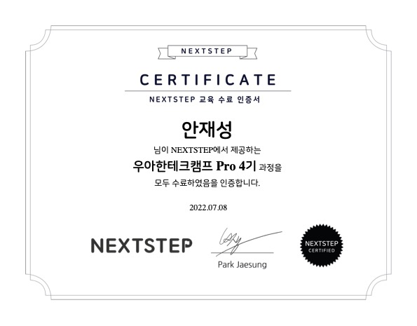

- **우아한형제들과 NEXTSETP에서 진행하는 재직자 교육과정**
    - 프로젝트 진행 및 코드리뷰를 통한 교육
- **프리코스과정**과 지원서를 통해 400명 지원자중 **60명 선발, 38명 수료**

### 학습내용

> TDD, ATDD, CleanCode, 리팩터링, 아키텍처 설계 운영, 서버 튜닝, JPA, 협업 스킬에 대하여 학습
> 
- 클린코드를 통해 유지보수하기 좋은 코드를 구현하는 경험
- JPA 기반으로 웹 애플리케이션을 개발하는 경험
- 단위, 인수 테스트를 기반으로 웹 애플리케이션을 개발하는 경험
- 레거시 코드를 안정적으로 리팩터링하는 경험
    - 테스트를 통한 코드 보호, 서비스 리팩터링, 의존성 리팩터링, 멀티 모듈 적용
- 시스템 아키텍처를 설계하고 운영하는 경험
    - 웹 성능 테스트, 부하테스트, 로깅 & 모니터링
- 대용량 데이터에 대해 최적화할 대상을 살펴보고, 서버를 튜닝하는 경험
    - 화면 응답 개선하기, 스케일 아웃(with ASG), 쿼리 최적화, 인덱스 설계

### 결과물

- [8주차 안정적인 서비스 만들기](https://github.com/jaesungahn91/infra-subway-performance/tree/jaesungahn91)
- [7주차 레거시 코드 리팩터링](https://github.com/jaesungahn91/jwp-refactoring/tree/jaesungahn91)
- [6주차 서비스 진단하기](https://github.com/jaesungahn91/infra-subway-monitoring/tree/jaesungahn91)
- [5주차 인수 테스트 기반 TDD](https://github.com/jaesungahn91/atdd-subway-service/tree/jaesungahn91)
- [4주차 AWS 서비스 인프라 구축](https://github.com/jaesungahn91/infra-subway-deploy/tree/jaesungahn91)
- [3주차 ATDD 인수 테스트 주도 개발](https://github.com/jaesungahn91/atdd-subway-admin/tree/jaesungahn91)
- [2주차 JPA](https://github.com/jaesungahn91/jwp-qna/tree/jaesungahn91)
- [1주차 로또 TDD](https://github.com/jaesungahn91/java-lotto-pro/tree/jaesungahn91)

