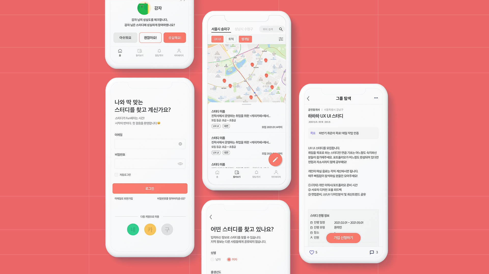

<!-- # 스펀지 -->

**스터디가 펀해지는 지금**

> **2021.02.22 ~ 2021.06.12** 

- 성공적인 스터디모임을 도와주는 **스터디모집 플랫폼**
- 근처 지역의 **구성원 모집**부터 원활한 모임진행을 위해 맞춤장소 추천

<aside>
스터디를 등록하고 참여할 수 있다
기본적으로 자신의 근처의 스터디를 확인 할 수 있으며 최대 3곳의 장소를 등록 할 수 있다
</aside>

### 기술 스택

- spring boot 2.2, postgresql 10, jpa, hibernate, Java 11, spring security, jwt, spring rest docs
- jenkins, aws(ec2, s3, rds), linux

### 개발 내용

- Spring Rest Docs와 ascii doc를 사용, 테스트 코드 작성을 통한 문서 자동화
- MockMvc 사용 테스트 코드 작성
- REST api 서버 구축에 대한 전반적인 부분을 이번 프로젝트를 통해서 많이 배웠습니다. 좋은 백엔드 개발자분과 같이 일했으며 이때 스터디와 사이드프로젝트의 중요성을 깨달았습니다.
- spring security의 기본적인 사용법과 커스텀요소들을 배웠습니다. JWT를 연계하여 인증 구현을 진행했습니다.
- 기존에도 jpa를 사용했었는데 이번 프로젝트에서 query dsl과 같은 방법으로 더욱 효율적이고 트랜디하게 사용하는 방법에 대해 배웠습니다.
- dto의 validation이나 validation을 커스텀해서 사용하는법, 어노테이션을 생성하는 방법을 배웠습니다.
- aop개념을 이용해 exception과 response를 글로벌 핸들러로 다루는법을 배웠습니다.